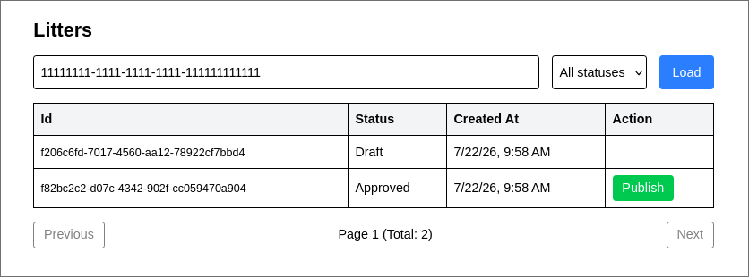

# CynoApp


A REST API (with a lightweight Angular UI) for managing breeders, litters, and their free-publication limits (benefits), built with a Clean N-Tier architecture on top of EF Core.

 
## Screenshot
 



## Tech Stack

**Backend**
- .NET, ASP.NET Core Web API
- Entity Framework Core — code-first, `AppDbContext`
- SQLite — local development database
- Repository / Service pattern — data access via `AppDbContext`, business rules in the service layer
DbContext`, business rules in the service layer
- Dependency Injection — built-in .NET DI container, registered per layer via extension methods (`AddDataAccess` in `CA.DAL`, `AddApplication` in `CA.BLL`), composed together in `CA.API`'s `Program.cs`


**Frontend**
- Angular (standalone components)
- Tailwind CSS v4 — utility-first styling
- `HttpClient` + a functional interceptor for attaching the `X-Breeder-Id` header automatically

## Architecture

The project follows a Clean N-Tier architecture, split into three main backend layers, plus a separate frontend project:
 
- **CA.DAL** (Data Access Layer) — entities (`Entities`), enums (`Enums`), exceptions (`Exceptions`), constants (`Constants`), EF Core context and configurations (`Persistence`), seed data (`Persistence.Seed`).
- **CA.BLL** (Business Logic Layer) — services (`Services`), interfaces (`Interfaces`), DTOs (`DTOs`).
- **CA.API** (Presentation Layer) — controllers, current-breeder context (`Context`), global exception middleware (`Middleware`), DI composition root (`Program.cs` calls `AddDataAccess()` and `AddApplication()`, each layer registering its own services/repositories).
- **frontend** — Angular app that consumes the API (list, filter, paginate, and publish litters through a simple UI).
Domain entities protect their state via private setters; business rules (e.g. checking the publication limit, valid status transitions) are encapsulated in entity methods (`BreederBenefit.EnlargeUsedCount`, `Litter.ChangeStatus`) and in the service layer.


### Cross-cutting concerns

- **Current breeder context** — instead of reading `X-Breeder-Id` directly in controllers via `[FromHeader]`, it's resolved once through `ICurrentBreederContext` (`CA.BLL.Interfaces`) / `HttpCurrentBreederContext` (`CA.API.Context`), keeping the header-parsing concern out of the business logic and controllers.
- **Global exception handling** — custom exceptions (`DomainException`, `NotFoundException`, `ForbiddenException`) are caught by `GlobalExceptionHandler` middleware and turned into a standardized JSON error response instead of raw framework errors.
- **Optimistic concurrency** — both `Litter` and `BreederBenefit` carry a `Guid RowVersion` concurrency token, regenerated manually on every state change (`ChangeStatus`, `EnlargeUsedCount`). SQLite has no native auto-updating rowversion, so the token is application-managed and configured via `IsConcurrencyToken()`. A `DbUpdateConcurrencyException` during publish is caught and surfaced as a `DomainException` ("Concurrent publish detected. Please try again."), preventing two parallel publish requests from both succeeding on the same free-publication slot.
- **Pagination validation** — `pageNumber`/`pageSize` are validated in the service layer; non-positive values raise a `DomainException` before hitting the repository.

### Key Entities

| Entity | Table | Description |
|---|---|---|
| `Litter` | `Litters` | A litter tied to a breeder (`BreederId`) with a status (`LitterStatus`: `Draft`, `Submitted`, `Approved`, `Published`) and a concurrency token (`RowVersion`). |
| `BreederBenefit` | `Benefits` | A breeder's free-publication limit (`FreeLimit`, `UsedCount`) and a concurrency token (`RowVersion`). |
| `AuditLog` | `Logs` | An append-only record of publish attempts (success/failure), keyed by `EntityId` and a fixed `Action` string from `AuditActions`. |

## Getting Started

### Prerequisites

- .NET SDK
- Node.js + npm, Angular CLI (`npm install -g @angular/cli`) — for the frontend
- A REST client (Postman) — optional, the Angular UI covers both endpoints
- `sqlite3` CLI or DB Browser for SQLite (optional, for inspecting the database)

### 1. Clone the repository

```bash
git clone <repo-url>
cd <project-folder>
```

### 2. Run the backend

```bash
cd backend
dotnet run --project CA.API
```

On first launch, the app applies EF Core migrations and seeds the database with test data via `DbSeeder`, including ready-made breeder scenarios for limit testing (see below). The API listens on `http://localhost:5072` by default (check the console output / `launchSettings.json` for the exact port).

Connection string (`backend/CA.API/appsettings.json`):
```json
"ConnectionStrings": {
  "DefaultConnection": "Data Source=cyno.db"
}
```

> If you change entity models that affect the database schema after cloning, or want a clean slate for testing, delete `cyno.db`, `cyno.db-shm`, `cyno.db-wal` from `backend/CA.API/` and re-run — migrations and seeding will run again from scratch.

### 3. Run the frontend

```bash
cd frontend
npm install
ng serve
```

Open `http://localhost:4200`. CORS is pre-configured on the backend to allow this origin.

Enter one of the seeded Breeder IDs (below) into the input field to start browsing litters and publishing.

## Inspecting the Database

```bash
sqlite3 backend/CA.API/cyno.db
```

```sql
.tables
.schema Benefits
.schema Litters

SELECT BreederId, FreeLimit, UsedCount FROM Benefits;
SELECT Id, BreederId, Status FROM Litters;
```

To avoid lock conflicts while the API is running, use read-only mode:

```bash
sqlite3 -readonly backend/CA.API/cyno.db "SELECT * FROM Benefits;"
```

## Seed Data for Testing

`DbSeeder` provisions ready-made scenarios to verify limit and ownership behavior:

| BreederId | Scenario | FreeLimit | Litters |
|---|---|---|---|
| `11111111-1111-1111-1111-111111111111` | Limit not reached | 3 | Approved, Draft, Published |
| `33333333-3333-3333-3333-333333333333` | Limit exhausted (`UsedCount` = 3) | 3 | Approved |
| `44444444-4444-4444-4444-444444444444` | No `BreederBenefit` record (used to test ownership / missing-benefit errors) | — | Approved |

Actual `Litter` IDs are randomly generated on each fresh seed. Query them directly:

```bash
sqlite3 backend/CA.API/cyno.db "SELECT Id, BreederId, Status FROM Litters;"
```

## API Endpoints

### Litters (`/api/litters`)

| Method | Endpoint | Headers | Description |
|---|---|---|---|
| POST | `/{litterId}/publish` | `X-Breeder-Id` | Publish a litter (must be `Approved` and owned by the requesting breeder; respects the `BreederBenefit` limit) |
| GET | `/` | `X-Breeder-Id` | Get a breeder's litters, filterable by `status` and paginated via `pageNumber` / `pageSize` query params |

## Testing Race Condition Protection

To reproduce and verify the optimistic-concurrency protection on `publish`, fire several parallel requests at the same litter:

```bash
LITTER_ID="<an Approved litter id, e.g. from BreederId 11111111-1111-1111-1111-111111111111>"
BREEDER_ID="11111111-1111-1111-1111-111111111111"

for i in 1 2 3 4 5; do
  curl -s -X POST "http://localhost:5072/api/litters/$LITTER_ID/publish" -H "X-Breeder-Id: $BREEDER_ID" &
done
wait
```

Expected result: exactly **one** request succeeds (`"status":"Published"`), the rest fail with either `"Concurrent publish detected. Please try again."` or `"Litter must be approved to publish."` — never more than one successful publish for the same litter.